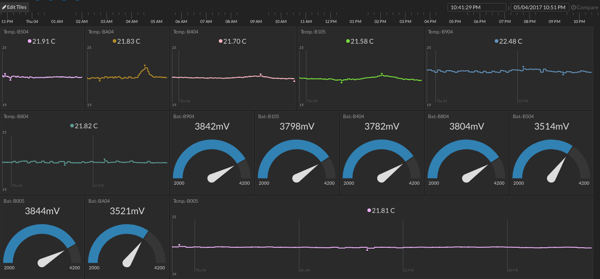
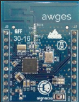

# Leaf - Rede de sensores de temperatura 6LoWPAN


Sistema de monitoramento de temperatura através de sensores 6LoWPAN utilizando MQTT e a plataforma Initial State para IoT.

__Desenvolvedor:__ Ânderson Ignacio da Silva</br>
Este projeto é divido em três partes:</br>
* broker_mqtt / Broker MQTT que roda em um servidor remoto (iot.awges.com) e que envia as mensagens recebidas do gateway ao initial state;
* leaf_gateway / Script em node.js que recebe os pacotes UDP em IPv6 dos sensores 6LoWPAN e publica as informações na Internet;
* leaf_node / Dispositivo 6LoWPAN que mede a temperatura ambiente através de um NTC e envia dados como temperatura, salto seguinte, RSSI e tensão de bateria para o broker MQTT no servidor remoto.



**Requisitos necessários:**
* Sistema rodando em um servidor remoto com domínio fixo
* Acesso a Internet pelo gateway
* Sensores 6LoWPAN com alcance ao border router no gateway
* Conta no Initial State

__broker_mqtt:__</br>
* **Tipo:** JavaScript / Node.js
* **Arquivo principal:** mqttInitialState.js e brokerMQTT.js
* **Descrição:** O broker MQTT executa um broker através do app Mosca para node.js com autenticação de usuário, o qual é utiliza um algoritmo para senha de autenticação. Ao executar o brokerMQTT.js um servidor MQTT na porta 8080 será aberto e ao executar o mqttInitialState.js todas as publicações serão enviadas a plataforma Initial State. Para que o mqttInitialState.js envie para a conta correta do initial-state, o usuário deve configurar o *bucket number* presente no script. Ambos os scripts devem rodar através do forever (npm/forever) pacote em javascript que mantém continuamente rodando um script em node.js.

__leaf_gateway:__</br>
* **Tipo:** JavaScript / Node.js
* **Arquivo principal:** udpIPv6.js
* **Descrição:** Este script executa o servidor UDP IPv6 na porta 7878 que recebe os dados dos dispositivos 6LoWPAN, e os encaminha ao broker MQTT (iot.awges.com). Paralelamente a execução do servidor UDP IPv6 deve-se executar também o init_6lowpan.sh em shell script, o qual realiza o tunelamento dos pacotes da rede 6LoWPAN através da criação da rede RPL. Veja o repositório [homestark](https://github.com/aignacio/homestark) para compreender como subir o border-router ou leia as observações no final.

__leaf_node:__</br>
</br>
* **Tipo:**  C
* **Arquivo principal:** main_leaf.c
* **Descrição:** Nesta pasta estão todos os arquivos do firmware do nó 6LoWPAN o qual deve executar a aplicação que monitora o NTC e envia os dados ao gateway. Todos os dados enviados como temperatura, salto, RSSI e bateria são enviado para um servidor UDP na porta 7878 que é executado no gateway. O arquivo de programação do nó tem o nome de *main_leaf.srf06-cc26xx* porém se tiver que ser compilado, basta colocar esta pasta dentro do repositório do contiki e instalar o *cross-compile-toolchain*.

**Obs.:** É necessário conectar o *border router* ou o rádio em SLIP para comunicação tunelada da rede 6LoWPAN com a interface. As duas formas de estabelecer a comunicação tunelada são:
1. Programar um dispositivo com o firmware de border router normalmente localizado no caminho (contiki/examples/ipv6/rpl-border-router), neste caso o *device* irá ser o border router da rede e você só precisa realizar o tunelamento via slip com o comando:
```bash
sudo contiki/tools/tunslip6 aaaa::1/64 -s /dev/ttyACMx
```
Neste modo a criação da rede RPL-DAG-ROOT será feita pelo próprio dispositivo.

2. Compilar o *native-border-router* normalmente localizado em (contiki/examples/ipv6/native-border-router) e rodar no próprio host, neste caso o *device* irá rodar somente o firmware *slip-radio* (contiki/examples/ipv6/slip-radio), o qual irá sniffar os pacotes 6LoWPAN e a conexão tunelada poderá ser aberta através do seguinte comando:
```bash
sudo contiki/examples/ipv6/native-border-router/border-router.native -L -v6 aaaa::1/64 -s /dev/ttyACMx -B 115200 -t tun0
```
Neste modo a criação da rede RPL-DAG-ROOT será feita pelo host.
